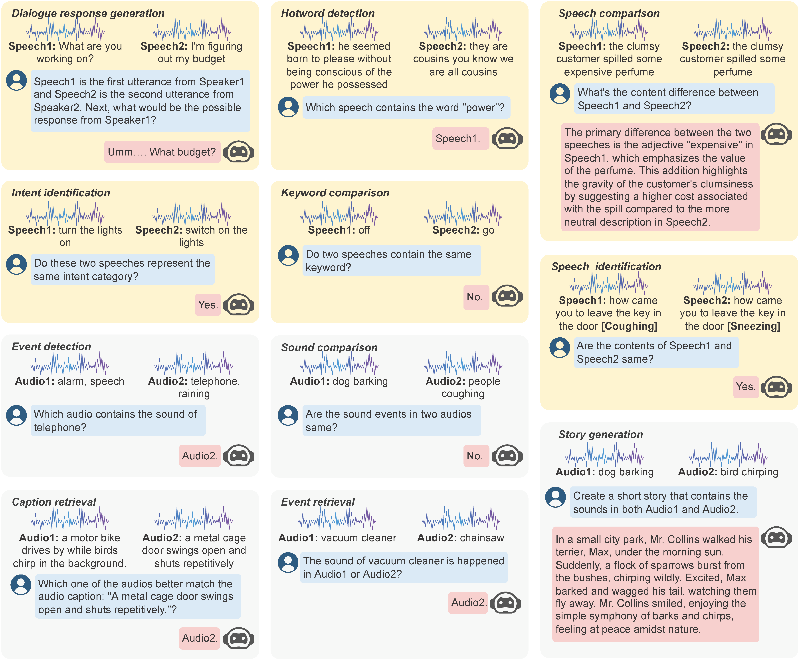

# MALLM

This repo contains the code and data of:
[Beyond Single-Audio: Advancing Multi-Audio Processing in Audio Large Language Models](https://arxiv.org/abs/2409.18680)


## Multi-Audio Training

The training data used in this project in available at [MALLM-Training Dataset](https://huggingface.co/datasets/hlt-lab/mallm-training)  hosted on Hugging Face.

### How to Use the Dataset

To load the dataset in your Python environment:

```python
from datasets import load_dataset

# Load the MALLM training dataset
dataset = load_dataset("hlt-lab/mallm-training")
```

## Multi-Audio Evaluation



The evaluation data used in this project is available at [MAE Dataset](https://huggingface.co/datasets/hlt-lab/mae) hosted on Hugging Face.

You can access it directly via the link and integrate it into your project by using the Hugging Face `datasets` library.

### How to Use the Dataset

To load the dataset in your Python environment:

```python
from datasets import load_dataset

# Load the MAE dataset with subset
dataset = load_dataset("hlt-lab/mae", 'meld-dialog')
```

### Available Data
MAE includes two types of tasks: MAE-Speech and MAE-Sound.

- MAE-Speech

| Subset                         | # Samples |         Task          |  Category   |
|--------------------------------|:---------:|:---------------------:|:-----------:|
| librispeech-comparison         |   1000    |   Speech Comparison   | Open-Ended  |
| timit-comparison               |   1000    |   Speech Comparison   | Open-Ended  |
| dailytalk-dialog               |   1000    |  Dialogue Generation  | Open-Ended  |
| meld-dialog                    |    304    |  Dialogue Generation  | Open-Ended  |
| librispeech-hotword            |  500/500  |   Hotword Detection   | Closed-Form |
| timit-hotword                  |  500/500  |   Hotword Detection   | Closed-Form |
| librispeech-identification     |  500/500  | Speech Identification | Closed-Form |
| wsj-identification             |  500/500  | Speech Identification | Closed-Form |
| audio-keyword-spotting-keyword |  513/513  |  Keyword Comparison   | Closed-Form |
| speech-commands-keyword        |  500/500  |  Keyword Comparison   | Closed-Form |
| fluent-speech-commands-intent  |  504/507  | Intent Identification | Closed-Form |

- MAE-Sound

| Subset                | # Samples |       Task        |  Category   |
|-----------------------|:---------:|:-----------------:|:-----------:|
| esc50-story           |   1000    | Story Generation  | Open-Ended  |
| urbansound-story      |   1000    | Story Generation  | Open-Ended  |
| esc50-comparison      |  500/500  | Sound Comparison  | Closed-Form |
| urbansound-comparison |  500/500  | Sound Comparison  | Closed-Form |
| audiocaps-retrieval   |  528/472  | Caption Retrieval | Closed-Form |
| clotho-retrieval      |  506/494  | Caption Retrieval | Closed-Form |
| esc50-retrieval       |  503/497  |  Event Retrieval  | Closed-Form |
| urbansound-retrieval  |  503/497  |  Event Retrieval  | Closed-Form |
| audioset-detection    |  500/500  |  Event Detection  | Closed-Form |

## Citation
If you use the MAE dataset in your research, please cite the following paper:
```
@article{chen2024beyond,
  title={Beyond single-audio: Advancing multi-audio processing in audio large language models},
  author={Chen, Yiming and Yue, Xianghu and Gao, Xiaoxue and Zhang, Chen and D'Haro, Luis Fernando and Tan, Robby T and Li, Haizhou},
  journal={arXiv preprint arXiv:2409.18680},
  year={2024}
}
```
